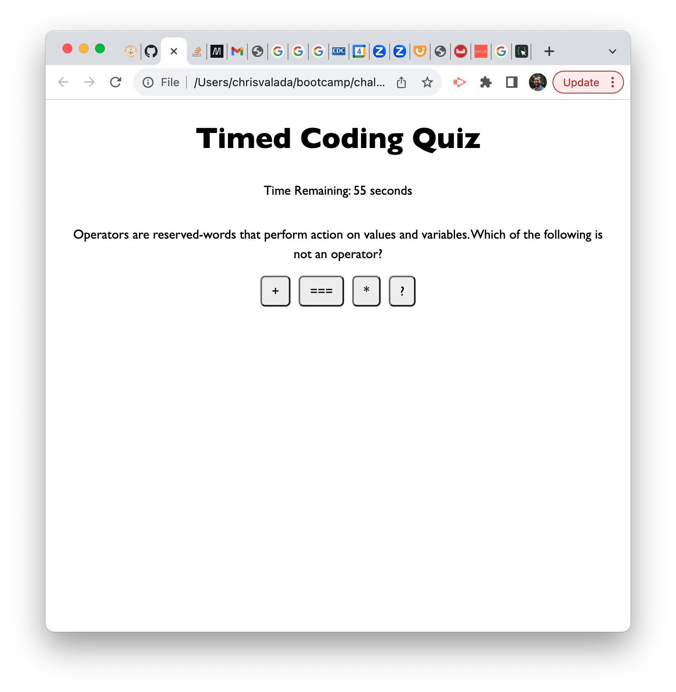
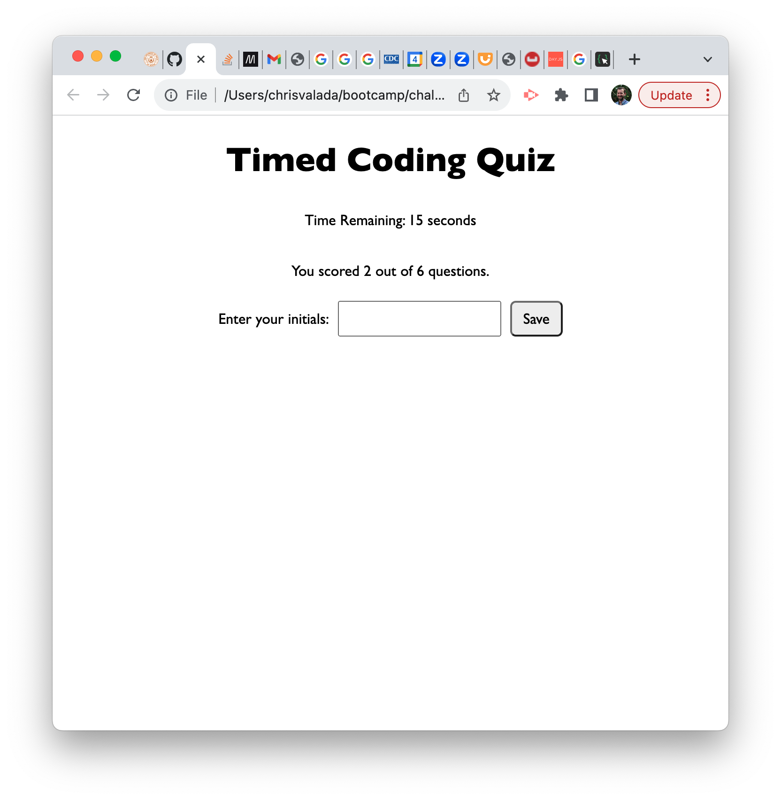

# Timed Coding Quiz

This is a 60-second multiple choice quiz written in Javascript. Each wrong answer deducts 10 seconds from the timer. Upon completion, users can save their scores to the browser storage. 

## User Story

```
AS A coding boot camp student
I WANT to take a timed quiz on JavaScript fundamentals that stores high scores
SO THAT I can gauge my progress compared to my peers
```

## Acceptance Criteria

```
GIVEN I am taking a code quiz
WHEN I click the start button
THEN a timer starts and I am presented with a question
WHEN I answer a question
THEN I am presented with another question
WHEN I answer a question incorrectly
THEN time is subtracted from the clock
WHEN all questions are answered or the timer reaches 0
THEN the game is over
WHEN the game is over
THEN I can save my initials and my score
```

## Mock-Up

The following animation demonstrates the application functionality:


## Screenshots

A user cliks the Start button to begin the quiz. 


This is 1 of 6 Questions.


At the end of the quiz, the user can enter his or her initials to save the score.


## Collaborators

None

## License

MIT

## Contact

GitHub: clvalada